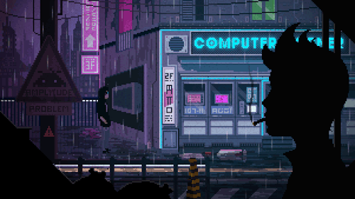

# Hey, I'm Parham 👋

I'm just a developer who loves learning, teaching, and building things.

Currently, I'm focused on **Kavlabs**, while spending a good amount of time exploring **cybersecurity**, **bug bounty hunting**, and how the web works under the hood.

## What I'm Building

### Kavlabs

A bilingual (**Persian & English**) project focused on **digital literacy**, **cybersecurity**, and making technical topics easier to understand.

Kavlabs also includes a Persian-language academy for learning programming and cybersecurity.

### Portfolio

A simple personal portfolio that I built for practice and experimentation.

## Tech Stack

## Contact

* Email: **[parhamfdev@proton.me](mailto:parhamfdev@proton.me)**
* Portfolio: **https://portfoblog-front-private.vercel.app/**

---

# Note

I hope you're doing well.

The reason for my inactivity on GitHub and my absence from my projects is the shutdown of international internet access in my country, along with extremely severe censorship, restrictions, and nearly unusable bandwidth.

I long for the day when knowledge and every human right — including free and unrestricted access to the internet — are not privileges, but are accessible to everyone, in Iran and throughout the world.

---

  

